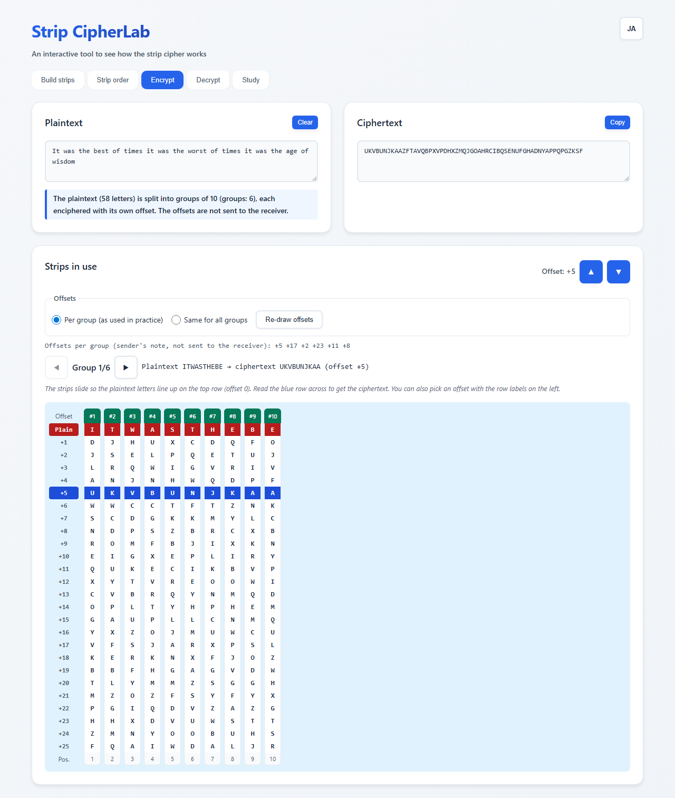
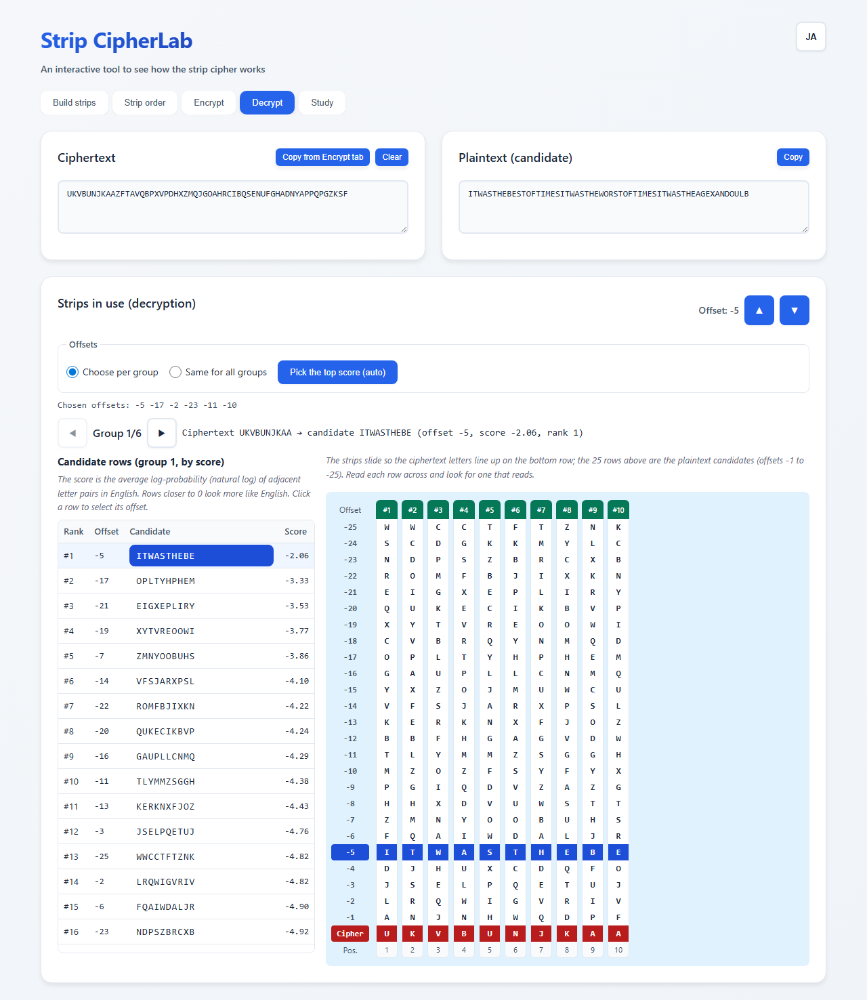
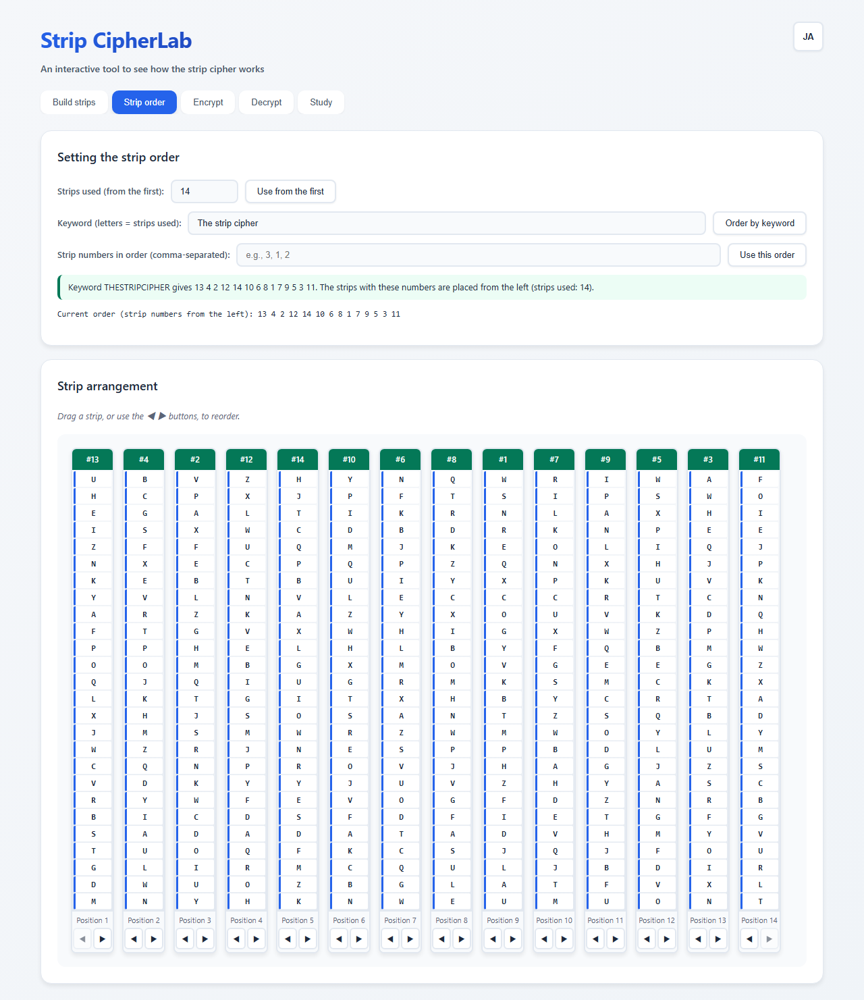

English · [日本語](README.md)

# Strip CipherLab - Strip Cipher Tool


[](https://ipusiron.github.io/strip-cipherlab/)

**Day071 - 100 Security Tools with Generative AI**

**Strip CipherLab** is a web tool for learning, by hand, how the strip cipher (a cipher that slides strips, such as the M-138-A) is built and why it works.

You make strips, set their order, slide them so the plaintext letters line up, and read another row, all in a 26-row window.

---

## 🌐 Demo

👉 **[https://ipusiron.github.io/strip-cipherlab/](https://ipusiron.github.io/strip-cipherlab/)**

Try it directly in your browser.

---

## 📸 Screenshots

>
>*Encrypt tab. Offsets change per group; for group 1, reading the blue row at offset +5 across gives the ciphertext*

>
>*Decrypt tab. The 25 candidates of group 1 ranked by score, with the top row (offset -5) selected*

>
>*Strip order tab. 14 strips placed by the keyword The strip cipher*

---

## ✨ Features

- Building strips: random strips (unbiased cryptographic random numbers), strips that can be rebuilt from a passphrase, or mixed alphabets typed by hand (one strip per line, up to 100 strips)
- Input check: each line is checked for each of A–Z exactly once, with the missing and repeated letters shown. Pairs of strips that match when slid are also reported
- Strip order: the first N strips, alphabetical numbering of a keyword, strip numbers entered directly, and reordering by dragging or with the ◀ ▶ buttons
- Window: the strips slide in a 26-row window. Reading the offset row across gives the ciphertext (or, when decrypting, a plaintext candidate)
- Offsets when encrypting: change them per group (as used in practice) or use one offset for all groups. Offsets per group are drawn with unbiased random numbers and can be re-drawn or chosen group by group
- Candidates when decrypting: the 25 candidate rows of each group are ranked by an English-likeness score. Click a row to select it, or pick the top score for all groups at once (auto-pick). With one offset for all groups, the whole text is scored instead
- Groups: text longer than the number of strips used is split into groups of that length, shown one group at a time
- Study: a summary of how it works and what to watch for
- English and Japanese: switch the screen language with the button at the top right

---

## 📖 How to use

1. On the "Build strips" tab, choose the number of strips and click "Random" or "From passphrase". If you typed mixed alphabets yourself, click "Create strips from these lines"
2. On the "Strip order" tab, set the order. With a keyword, the number of letters in the keyword becomes the number of strips used
3. On the "Encrypt" tab, type the plaintext. Offsets are drawn at random per group; use ▲ ▼ or the row labels on the left of the window to choose again for the group shown. Reading the offset row (blue) across gives the ciphertext
4. On the "Decrypt" tab, click "Copy from Encrypt tab" or paste a ciphertext. For each group, read the rows of the window across or look at the candidate table, and click the row that reads. "Pick the top score (auto)" selects every group at once

The sender and receiver must share the same set of strips (the same passphrase and count also works) and the same strip order. The offsets are not sent to the receiver.

---

## 🔐 The strip cipher

The strip cipher lines up many long strips, each printed with a mixed alphabet, aligns the plaintext on one row, and reads another row as the ciphertext. It is a substitution cipher.

### How encryption works

1. Split the plaintext into groups of r letters, where r is the number of strips used (the last group may be shorter)
2. Find the i-th letter of the group on the i-th strip of the strip order, and slide the strip until that letter is on the base row (offset 0)
3. Copy the row g rows below the base row (offset g, 1–25) as the ciphertext of the group
4. Move on to the next group and repeat

In practice, the offset was chosen freely for each group and was not part of the key. The receiver can find the plaintext without knowing the offsets, by the decryption steps below. This tool lets you change the offset per group (the default) or use one offset for all groups. With one offset you can watch the weakness described in "Cryptographic notes" below.

### How decryption works

1. Place the strips in the same order as the sender, and split the ciphertext into groups of r letters
2. Slide the strips so the ciphertext of the group lines up on one row
3. Read the other 25 rows across and take the one that makes sense as the plaintext
4. Do the same for every group and join them back into the plaintext

### Worked example (same offset for all groups)

Five strips made from the passphrase STRIP, placed by the keyword STRIP (strip order: 4 5 3 1 2), with every group enciphered at offset +7:

- Plaintext: ATTACKATDAWNMEETATTHEOLDMILL
- Ciphertext: GQFQPIOFNGXWZVQZOFDNKUONKCDO

Reading the window of group 1, ATTAC, across gives these rows:

| Offset | Row |
|---|---|
| 0 (plaintext) | ATTAC |
| +1 | UKBUD |
| +2 | LZLWO |
| +3 | WBUSI |
| +4 | NEZNU |
| +5 | BCSRY |
| +6 | CRREV |
| +7 | GQFQP |

When decrypting, lining up the ciphertext GQFQP on the bottom row makes ATTAC appear 7 rows above.

This group has only 5 letters, though. Ranked by score, ODETH at offset -17 (score -2.37) comes first and the correct ATTAC (score -2.76) comes second. If you know that one offset was used for all groups, you can score the whole text decrypted with each offset instead, and offset -7 comes first.

### Worked example (offsets per group and auto-pick)

Ten strips made from the passphrase STRIP, placed from the first, with the offset changed for each group:

- Plaintext: ITWASTHEBESTOFTIMESITWASTHEWORSTOFTIMESITWASTHEAGEOFWISDOM
- Offsets per group: +5 +17 +2 +23 +11 +8
- Ciphertext: UKVBUNJKAAZFTAVQBPXVPDHXZMQJGOAHRCIBQSENUFGHADNYAPPQPGZKSF
- Auto-pick (top score per group): -5 -17 -2 -23 -11 -10

The five groups of 10 letters had the correct offset ranked first. Only in the last group of 8 letters was the correct offset -8 (OFWISDOM) ranked #3. Choosing it again from the candidate table restores the whole text.

### Scores and auto-pick

The score of a candidate row is the average log-probability (natural log) of its adjacent letter pairs in English. Rows closer to 0 look more like English. The table was made by counting letter pairs in Project Gutenberg's *Pride and Prejudice* (#1342) with only the letters kept, adding 1 to every pair, and taking the share of each pair for its first letter (`tools/build-english.mjs`).

From a different book that was not used for the table (*A Tale of Two Cities*, #98), we took text at random positions, enciphered it with random strips and offsets, and measured where the correct offset ranked, 2,000 times for each length (`tools/evaluate.mjs`, with a fixed random seed).

| Group length | Correct at #1 | Within top 3 |
|---|---|---|
| 5 letters | 69.8% | 93.8% |
| 8 letters | 92.5% | 99.4% |
| 10 letters | 97.3% | 100.0% |
| 15 letters | 99.9% | 100.0% |
| 20 letters | 100.0% | 100.0% |

With one offset for all groups, choosing by the score of the whole text:

| Strips used | Text length | Correct at #1 |
|---|---|---|
| 5 strips | 10 letters | 97.3% |
| 5 strips | 15 letters | 99.8% |
| 10 strips | 20 letters | 100.0% |
| 10 strips | 30 letters | 100.0% |

The shorter the group, the more often a row that looks like English by chance ranks first. The tool shows a note for groups shorter than 8 letters. After the auto-pick, also check that each group reads well together with its neighbors.

### Strip order (one keyword method: alphabetical numbering)

Each letter of the keyword is numbered in alphabetical order (A→Z). When a letter appears more than once, the occurrences are numbered from the left.

1. Remove everything but letters from the keyword and make it upper case (e.g., `"The strip cipher"` → `THESTRIPCIPHER`)
2. Going from A to Z, number the positions where each letter appears 1, 2, 3, … (repeated letters from the left)
3. The resulting numbers are the strip numbers placed from the left

Example (14 strips): `THESTRIPCIPHER` → `13 4 2 12 14 10 6 8 1 7 9 5 3 11`

Example (20 strips): the keyword repeated up to 20 letters, `THESTRIPCIPHERTHESTR` → `17 5 2 15 18 12 8 10 1 9 11 6 3 13 19 7 4 16 20 14`

In this tool, the number of letters in the keyword becomes the number of strips used. To use 20 strips, enter a 20-letter keyword such as `The strip cipher the str`. A keyword longer than the number of strips is rejected with a message. This numbering is one way of ordering the strips; other methods exist.

---

## ⚙️ Specification (simplified model for learning)

- Alphabet: A–Z (26 letters)
- Normalization: everything but letters is removed and letters are made upper case. Full-width letters become ASCII and accents are removed (é → E)
- Strips: 26-letter mixed alphabets. Like the real ones, they are drawn as 52 letters (printed twice), and the window shows 26 rows
- Number of strips: 1–100. Strips used: from 1 up to the number of strips
- Offset: +1 to +25 (down) when encrypting and -1 to -25 (up) when decrypting. The Encrypt and Decrypt tabs keep their own offsets
- How offsets are set: per group (default) or one for all groups. Offsets per group for encryption are drawn with `crypto.getRandomValues` (unbiased)
- Score: the average log-likelihood, from the table, of the adjacent letter pairs of a candidate row. Rows with fewer than 2 letters get no score
- Groups: text longer than the number of strips used is split into groups of that length, and the strips in the same order are used again for each group
- Random strips: a Fisher–Yates shuffle with random numbers from `crypto.getRandomValues`, redrawing values that would bias the remainder
- Strips from a passphrase: the same passphrase and count always give the same set. The procedure is a Fisher–Yates shuffle driven by the mulberry32 pseudo-random generator, seeded with the 32-bit FNV-1a hash of the passphrase in UTF-8 + `#` + the strip number. Leading and trailing spaces are ignored, and upper and lower case differ
- Input check: if any line does not have each of the 26 letters exactly once, the strips are not rebuilt

---

## 🧮 Mathematical notes

- A single strip has 26! possible orders
- The number of ways to choose r of n strips in order is nPr = n!/(n−r)! (do not multiply by r! again)
- Orders that match when slid count as the same strip, so there are 26!/26 = 25! distinct strips
- Offsets are 1–25, so no plaintext letter is ever enciphered as itself

---

## 📜 History notes

- Lineage: the Jefferson wheel cipher and the Bazeries cylinder stretched out into strips. Parker Hitt proposed it to the director of the Army Signal School in a memorandum dated December 19, 1914. He used 25 paper strips, each printed twice with a mixed alphabet, aligned the plaintext on one row, and took another row as the ciphertext (Kahn, pp.325–326)
- The cylinder form: in 1922 the Army adopted the M-94, 25 disks on a spindle (Kahn, p.326)
- M-138-A: in the 1930s the Army returned to Hitt's strip form and built the M-138-A, which used 30 of 100 strips at a time. The State Department adopted it for its most important communications in the late 1930s and early 1940s (Kahn, p.326). The State Department split the 30-letter line into groups of 15 and read them from two offsets (Kahn, p.493)
- U.S. Navy: used as CSP 642, dropping 0 to 5 of the 30 strips from day to day to vary the number used (Kahn, p.582)
- Japan: captured U.S. Navy strips on Wake and Kiska and tried to break them. Its codebreakers also used the fact that no plaintext letter is enciphered as itself, but finally judged the strip cipher unbreakable for all practical purposes and shifted their effort to traffic analysis (Kahn, pp.582–583)
- Germany: the German Foreign Office codebreakers (Pers Z S) broke the State Department strip cipher O-2. Systematic work began in November 1942, and they recovered all 50 strips and all 40 day keys. The day keys were assigned to dates by a calendar, and the same day key was used several times (TICOM I-89)

---

## 🎓 Cryptographic notes (for learning)

- The strip cipher is a substitution cipher that uses a different mixed alphabet for each column
- With one offset for all groups, every group is enciphered with the same substitution tables, so the cipher becomes a periodic polyalphabetic substitution with period r. In long ciphertexts, the index of coincidence (IC) per period reveals r
- With offsets changed per group, the substitution table of the same column changes from group to group. The receiver is not told the offsets and picks the readable row out of 25
- Decryption is a matter of judging which candidate row reads as natural text. Short groups can leave several candidates, which the context of the neighboring groups narrows down

---

## 🎯 Use cases

- Computing and history classes: students slide strips in the window to follow the line from the Jefferson cylinder to the M-138-A, and see by hand that the cylinder and the strips are the same mechanism in different forms
- Self-study of cryptography: enter the passphrase, keyword, and plaintext of the worked example, move the offset one step at a time, and watch how the ciphertext changes and why no letter is enciphered as itself
- Puzzle and escape-room design: make a set of strips from a passphrase and print the mixed alphabets as paper strips. Players line up the strips and look for the row that reads
- Crafts: use the 26 letters printed twice as a template when making real strips from paper or wooden sticks
- Secret letters with family and friends: if you agree on a passphrase and a keyword, the other side can make the same strips and order at hand
- Security training: discuss "what fixing part of the key (the offset) turns the cipher into", "key distribution", and "the quality of random numbers" with a classical cipher. Strips from a passphrase are an example of key handling: they can be rebuilt, but anyone who guesses the passphrase can rebuild them too
- Codebreaking practice: share only the strips and the strip order with friends, and send ciphertexts to each other without telling the offsets
- Historical reading: reproduce the procedures described in Kahn's *The Codebreakers* or the TICOM reports at hand
- Combining with other tools: paste a long ciphertext made with one offset into [IC Learning Visualizer](https://ipusiron.github.io/ic-learning-visualizer/) (Day047) to see the period equal to the number of strips used in the IC per period. You can compare it, as a periodic polyalphabetic substitution, with [Vigenere Cipher Tool](https://ipusiron.github.io/vigenere-cipher-tool/) (Day017), or compare keyword numbers with [Columnar CipherLab](https://ipusiron.github.io/columnar-cipherlab/) (Day043), which uses the same alphabetical numbering

The strip cipher is a classical cipher and cannot protect real communications. The author does not encourage misuse.

---

## 🔒 Security

- All processing happens in the browser; the text you enter and the strips you make are not sent anywhere
- A Content Security Policy (`default-src 'self'` and related directives) is set with a meta element, so no external scripts, styles, or connections are loaded. No inline scripts, inline event handlers, or style attributes are used
- Text you enter is drawn with `textContent`
- Random strips use `crypto.getRandomValues`. Strips from a passphrase use a fixed pseudo-random procedure for reproducibility, not a secure key derivation

---

## ❓ FAQ

### Q. Why is the same 26-letter alphabet printed twice on each strip?

A. Real strips are not loops, so they are hard to align when they stop at an end. With the alphabet printed twice, whichever letter you put on the base row, 25 more rows follow below it.

### Q. Should the offset really be random?

A. At the very least, avoid a fixed offset. With one offset for all groups, the cipher becomes a periodic polyalphabetic substitution with period r.

### Q. What if several candidate rows look readable?

A. Narrow them down with the context of the neighboring groups. The longer the group, the less likely a row reads by chance.

### Q. What if the keyword is shorter than the number of strips I want?

A. In this tool, the number of letters in the keyword becomes the number of strips used. To use 20 strips, repeat the keyword up to 20 letters (see the example in "Strip order" above).

### Q. Does the auto-pick always find the right row?

A. No. In a short group, a row can look like English by chance and rank first (see the table in "Scores and auto-pick" above). Text that is not in English, or that has many names or numbers, is more likely to be missed.

### Q. Are strips made from a passphrase secure?

A. The procedure always makes the same set from the same passphrase, so anyone who guesses the passphrase can rebuild the strips. It is meant for practice and sharing.

---

## 🧪 Tests

```bash
npm test
```

- Runs on Node.js 22 or later, with no dependencies
- Checks the core logic (known answers, round trips, boundaries), the worked examples and keyword examples in both READMEs, static checks of index.html, color contrast ratios, the English and Japanese dictionaries, and line lengths
- The known answers were checked against an independently written Python reference implementation
- The English table is rebuilt from the training text and compared, and the tables in "Scores and auto-pick" are compared with the output of `tools/evaluate.mjs`
- GitHub Actions runs the tests on every push and pull request

---

## 🔗 References

- David Kahn, *The Codebreakers*, Macmillan, 1967. (pp.325–326, 493, 582–583)
- TICOM I-89, "The American Strip Cipher O-2", 1945. (https://archive.org/details/ticom)
- Project Gutenberg #1342 *Pride and Prejudice* (Jane Austen) and #98 *A Tale of Two Cities* (Charles Dickens). The excerpts used for the score table and the evaluation are in `tools/corpus/`. Both are in the public domain in the United States

---

## 📁 Directory structure

```
strip-cipherlab/
├── .github/                  # GitHub settings
│   └── workflows/            # GitHub Actions workflows
│       └── test.yml          # Runs npm test on push and pull_request
├── assets/                   # Images
│   ├── en/                   # Screenshots of the English screen
│   │   ├── screenshot.png    # Encrypt tab (English)
│   │   ├── screenshot2.png   # Decrypt tab (English)
│   │   └── screenshot3.png   # Strip order tab (English)
│   ├── screenshot.png        # Screenshot (Encrypt tab, Japanese)
│   ├── screenshot2.png       # Screenshot (Decrypt tab, Japanese)
│   └── screenshot3.png       # Screenshot (Strip order tab, Japanese)
├── js/                       # Scripts loaded by the page
│   ├── english-data.js       # Table of English letter-pair log-likelihoods (generated)
│   ├── i18n.js               # Chooses the language and replaces static text
│   ├── messages.js           # Dictionary of screen text (Japanese and English)
│   └── strip-core.js         # Core logic (normalization, checks, keyword order, encryption, decryption, window, candidate scores, random strips)
├── test/                     # Automated tests (node --test)
│   ├── contrast.test.js      # Color contrast ratios
│   ├── core.test.js          # Core logic: known answers, round trips, boundaries
│   ├── english.test.js       # English table, scores, candidates, evaluation
│   ├── format.test.js        # Line lengths and line endings
│   ├── html.test.js          # Static checks of index.html (CSP, ARIA, ids)
│   ├── i18n.test.js          # Dictionaries, HTML text, initial language
│   ├── load.js               # Loads js/*.js in the tests
│   ├── messages.test.js      # Dictionary keys and strings in script.js
│   └── readme.test.js        # Checks the examples and structure of both READMEs
├── tools/                    # Development scripts and English texts (not used by the page)
│   ├── corpus/               # English excerpts (Project Gutenberg)
│   │   ├── eval-pg98.txt     # For evaluation (#98 A Tale of Two Cities)
│   │   └── train-pg1342.txt  # For the table (#1342 Pride and Prejudice)
│   ├── build-english.mjs     # Builds js/english-data.js from the training text
│   └── evaluate.mjs          # Measures how often the score finds the right row
├── .gitignore                # Git ignore rules
├── .nojekyll                 # Turns off Jekyll on GitHub Pages
├── AGENTS.md                 # Guidelines for AI agents
├── CLAUDE.md                 # Guidelines for Claude Code
├── LICENSE                   # MIT License
├── README.en.md              # This file (English)
├── README.md                 # README (Japanese)
├── index.html                # The page (five tabs)
├── package.json              # Defines npm test (no dependencies)
├── script.js                 # Page control (state, rendering, events)
└── style.css                 # Stylesheet
```

---

## 💻 Requirements

- Tested in Chromium-based browsers (Chrome, Edge) and Firefox
- No server is needed; you can open index.html directly in a browser. To use a local server, run `python -m http.server 8000` and open http://localhost:8000/
- On narrow screens, scroll the window sideways to see all the strips

---

## 📄 License

MIT License – see [LICENSE](LICENSE) for details.

---

## 🛠️ About this tool

This tool was developed as part of the "100 Security Tools with Generative AI" project.
The project creates and publishes a wide variety of security-related tools over 100 days with the help of AI.

For details and other tools, see:

🔗 [https://akademeia.info/?page_id=42163](https://akademeia.info/?page_id=42163)
