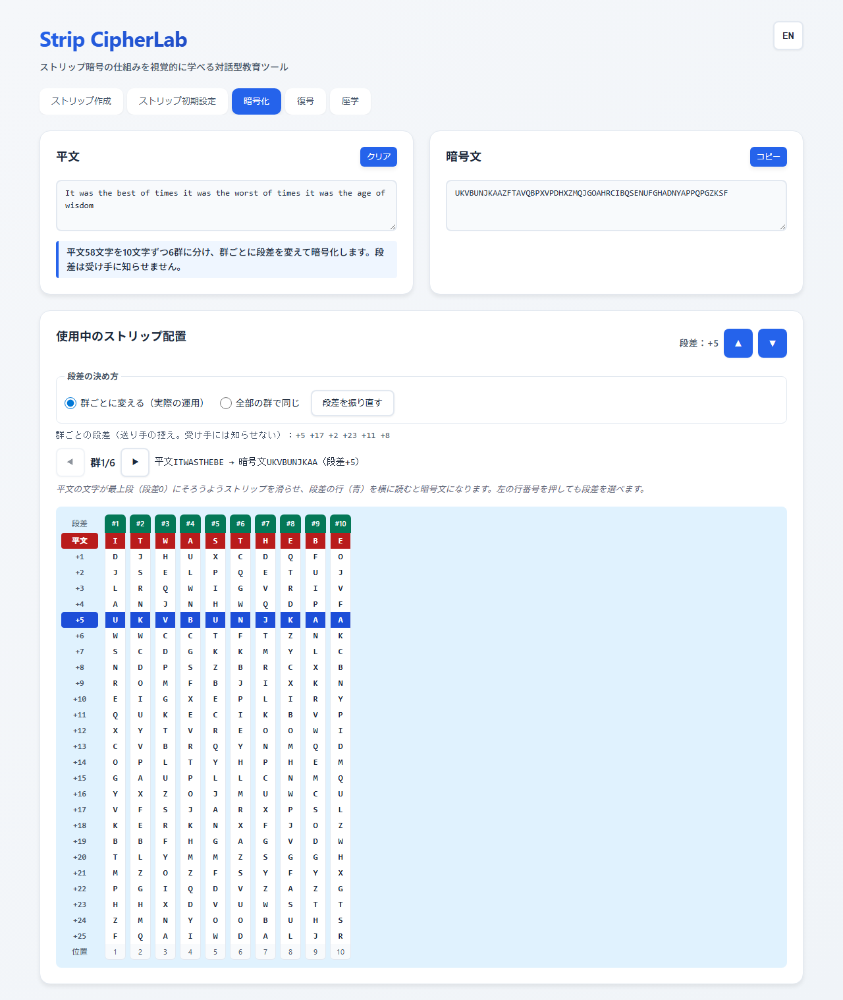
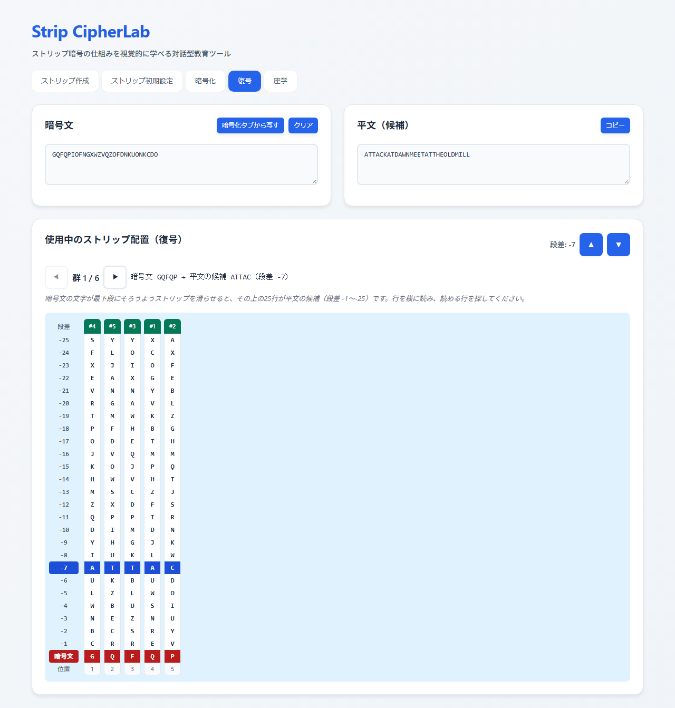
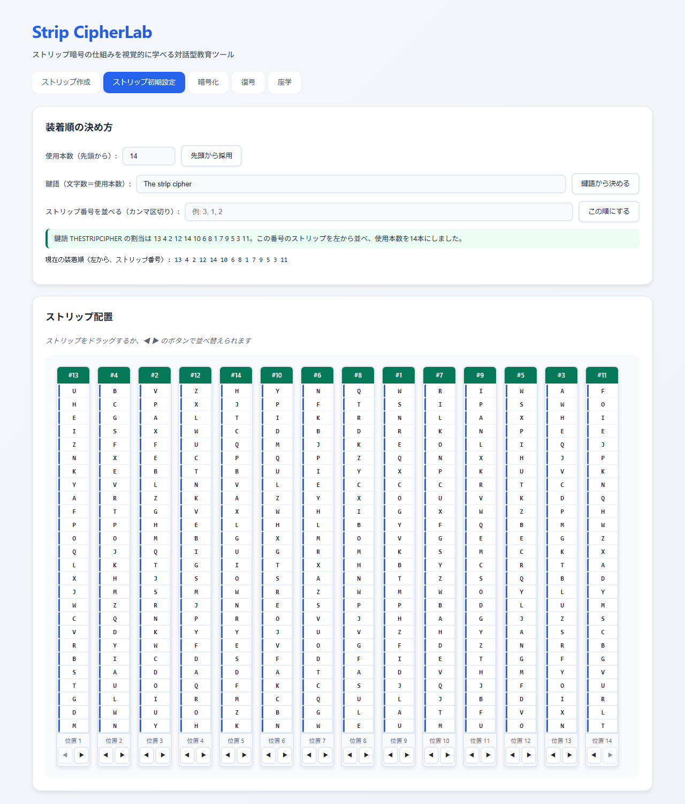

<!--
---
id: day071
slug: strip-cipherlab

title: "Strip CipherLab"

subtitle_ja: "ストリップ暗号の構造と考え方を直感的に学ぶ教育ツール"
subtitle_en: "Interactive educational tool for understanding strip cipher structure"

description_ja: "ストリップ生成、装着順の設定、暗号化、復号という一連の手順を、26行の窓でストリップを滑らせながら体験し、ストリップ暗号の構造と考え方を理解できるWebツールです。"
description_en: "A web tool to grasp the strip cipher's structure by sliding strips in a 26-row frame: generate strips, set the frame order, then encrypt and decrypt step-by-step."

category_ja:
  - 古典暗号
  - 換字式暗号
category_en:
  - Classical Cryptography
  - Substitution Cipher

difficulty: 1

tags:
  - strip-cipher
  - classical-crypto
  - education
  - visualization
  - javascript

repo_url: "https://github.com/ipusiron/strip-cipherlab"
demo_url: "https://ipusiron.github.io/strip-cipherlab/"

hub: true
---
-->

# Strip CipherLab - ストリップ暗号ツール


[](https://ipusiron.github.io/strip-cipherlab/)

**Day071 - 生成AIで作るセキュリティツール100**

**Strip CipherLab**は、ストリップ暗号（M-138-A などの帯を滑らせる暗号）の構造と考え方を、手を動かして理解できるWebツールです。

ストリップを作り、装着順を決め、平文の文字がそろうようにストリップを滑らせて別の行を読む、という手順を26行の窓で体験できます。

---

## 🌐 デモページ

👉 **[https://ipusiron.github.io/strip-cipherlab/](https://ipusiron.github.io/strip-cipherlab/)**

ブラウザーで直接お試しいただけます。

---

## 📸 スクリーンショット

>
>*暗号化タブ。平文の文字が最上段にそろい、段差+7の行が暗号文になる*

>
>*復号タブ。暗号文の文字を最下段にそろえ、上の25行から読める行を探す*

>
>*初期設定タブ。鍵語 The strip cipher の割当で14本を並べた状態*

---

## ✨ 主な機能

- ストリップ作成：ランダム生成（偏りのない暗号用の乱数）、合言葉から再現できる生成、乱字列の手入力（1行1本、最大100本）
- 入力の検査：26文字が1回ずつかを行ごとに調べ、足りない文字・重なった文字を示す。滑らせると同じ並びになるストリップの組も知らせる
- 装着順：先頭から使う本数、鍵語のアルファベット順の割当、ストリップ番号の直接指定、ドラッグや ◀ ▶ のボタンでの並べ替え
- 暗号化・復号：26行の窓でストリップを滑らせて見せる。段差の行を横に読むと暗号文（復号では平文の候補）になる
- 群の切り替え：使用本数より長い文は、使用本数ずつの群に分けて1群ずつ窓に出す
- 座学：仕組みと注意点のまとめ

---

## 📖 使い方

1. 「ストリップ作成」タブで本数を決め、「ランダム生成」か「合言葉から生成」を押します。乱字列を自分で書いた場合は「この乱字列でストリップを作る」を押します
2. 「ストリップ初期設定」タブで装着順を決めます。鍵語を使うと、鍵語の文字数が使用本数になります
3. 「暗号化」タブに平文を入力し、▲ ▼ か窓の左の行番号で段差を選びます。段差の行（青）を横に読んだものが暗号文です
4. 「復号」タブで「暗号化タブから写す」を押すか暗号文を貼り、窓の行を横に読んで読める行を探します。その行の段差を選ぶと平文が出ます

送り手と受け手は、同じストリップの一式（同じ合言葉と本数でも作れます）と同じ装着順を持っている必要があります。段差は受け手に知らせません。

---

## 🔐 ストリップ暗号

ストリップ暗号（strip cipher）は、ランダム順のアルファベットを印字した細長い帯（ストリップ）を何本も並べ、平文を1行にそろえたうえで、別の行を暗号文として読み出す換字式暗号です。

### 暗号化の仕組み

1. 使用本数 r に合わせ、平文を r 文字ずつの群（最後の群は短くてよい）に分ける
2. 群の i 文字目を、装着順 i 番目のストリップで探し、その文字が基準の行（段差0）にくるまでストリップを上下に滑らせる
3. 基準の行から段差 g 行（1〜25）下の行を、その群の暗号文として書き写す
4. 次の群へ進み、同じ手順を繰り返す

実際の運用では、段差は群ごとに自由に選び、鍵には含めません。受け手は段差を知らなくても、次の復号の手順で平文を見つけられます。このツールの暗号化は、全部の群に同じ段差を使います（下の「暗号学的考察」の弱さを観察できます）。

### 復号の仕組み

1. 送り手と同じ装着順でストリップを並べ、暗号文を r 文字ずつの群に分ける
2. 群の暗号文が1行にそろうようにストリップを滑らせる
3. 残りの25行を横に読み、意味の通る行を平文として採用する
4. すべての群で同じことを行い、つなげて平文に戻す

### 計算例

合言葉 STRIP で5本を作り、鍵語 STRIP の割当で並べ（装着順 4 5 3 1 2）、段差 +7 で暗号化した例です。

- 平文：ATTACKATDAWNMEETATTHEOLDMILL
- 暗号文：GQFQPIOFNGXWZVQZOFDNKUONKCDO

1群目 ATTAC の窓を横に読むと、次のように並びます。

| 段差 | 行 |
|---|---|
| 0（平文） | ATTAC |
| +1 | UKBUD |
| +2 | LZLWO |
| +3 | WBUSI |
| +4 | NEZNU |
| +5 | BCSRY |
| +6 | CRREV |
| +7 | GQFQP |

復号では、暗号文の GQFQP を最下段にそろえると、7行上に ATTAC が現れます。

### ストリップの並べ順（鍵語による一例：アルファベット順の割当）

鍵語の各文字に、アルファベット順（A→Z）で番号を振る方式です。同じ文字が複数回出る場合は、左から現れる順に若い番号を与えます。

1. 鍵語から英字以外を除き、大文字にする（例：`"The strip cipher"` → `THESTRIPCIPHER`）
2. A から Z の順に、その文字が現れる位置へ 1, 2, 3, … と番号を振る（同じ文字は左から）
3. 得られた番号の並びが、左から並べるストリップの番号になる

例（14本）：`THESTRIPCIPHER` → `13 4 2 12 14 10 6 8 1 7 9 5 3 11`

例（20本）：鍵語を20文字まで繰り返した `THESTRIPCIPHERTHESTR` → `17 5 2 15 18 12 8 10 1 9 11 6 3 13 19 7 4 16 20 14`

このツールでは、鍵語の文字数が使用本数になります。20本で使うときは、`The strip cipher the str` のように20文字の鍵語を入力します。鍵語がストリップの本数より長い場合は、装着順を決めずに知らせます。この割当は並べ方の一例で、ほかの決め方もあります。

---

## ⚙️ 仕様（教育用簡易モデル）

- アルファベット：A〜Z（26文字）
- 正規化：英字以外を除き、大文字にする。全角英字は半角に、アクセント記号は外す（é → E）
- ストリップ：26文字の乱字列。実物と同じく2回続けた52文字で描き、窓には26行だけを見せる
- 本数：1〜100本。使用本数は1本からストリップの本数まで
- 段差：暗号化は +1〜+25（下へ）、復号は -1〜-25（上へ）。暗号化タブと復号タブで別々に持つ
- 群：使用本数より長い文は、使用本数ずつの群に分け、同じ装着順のストリップを繰り返し使う
- ランダム生成：`crypto.getRandomValues` の乱数で Fisher–Yates の並べ替えを行い、余りの偏りが出る値は捨てて引き直す
- 合言葉から生成：同じ合言葉と本数から、いつも同じ一式を作る。手順は FNV-1a 32ビット（合言葉の UTF-8 ＋ `#` ＋ 番号）を種にした mulberry32 の擬似乱数で Fisher–Yates の並べ替えを行う。前後の空白は無視し、大文字と小文字は区別する
- 入力の検査：26文字が1回ずつでない行があると、ストリップを作り直さない

---

## 🧮 数学的補足

- ストリップ1本の並びは 26! 通りある
- n本から r本を順序つきで選ぶ総数は nPr = n!/(n−r)! である（r! を重ねて掛けない）
- 滑らせて重なる並びは同じストリップとみなせるので、区別できるストリップは 26!/26 = 25! 通りである
- 段差は1〜25なので、平文の文字が同じ文字に暗号化されることはない

---

## 📜 歴史メモ

- 系譜：ジェファソンのホイール暗号とバゼリーの円筒を、帯の形に伸ばしたものである。パーカー・ヒット（Parker Hitt）が1914年12月19日の覚書で陸軍通信学校長に提案した。混合アルファベットを2回印字した紙の帯25本を使い、平文を1行にそろえて別の行を暗号文にした（Kahn, pp.325–326）
- 円筒型：陸軍は1922年に、25枚の円板を軸に通した M-94 を制式化した（Kahn, p.326）
- M-138-A：1930年代に陸軍はヒットの帯の形へ戻し、100本から30本を使う M-138-A を作った。国務省は1930年代末から1940年代初めにかけて、最も重要な通信に採用した（Kahn, p.326）。国務省では30本の行を15文字ずつに分け、2つの段差から読み出した（Kahn, p.493）
- 米海軍：CSP 642 として使い、30本のうち0〜5本を日ごとに抜いて、使う本数を変えた（Kahn, p.582）
- 日本：ウェーク島とキスカで米海軍のストリップを手に入れ、解読を試みた。特務班は、平文の文字が同じ文字にならない性質も使って攻めたが、最後は事実上解けないものとみなし、通信解析に重心を移した（Kahn, pp.582–583）
- ドイツ：外務省の暗号解読部門（Pers Z S）が、国務省のストリップ暗号 O-2 を解読した。1942年11月に組織的な作業を始め、50本のストリップと40通りの日鍵をすべて復元した。日鍵は日付ごとに割り当てられ、同じ日鍵が何度も使われていた（TICOM I-89）

---

## 🎓 暗号学的考察（教育的視点）

- ストリップ暗号は、列ごとに別の混合アルファベットを使う換字式暗号である
- 段差を全部の群で同じにすると、どの群も同じ換字表で暗号化され、周期 r の多表式換字になる。長い暗号文では、周期ごとの一致指数（IC）で r が見えてくる
- 段差を群ごとに変えると、同じ列でも群ごとに換字表が変わる。受け手は段差を知らされず、25行から読める行を選ぶ
- 復号は「自然な文として読めるか」を手がかりに候補の行を選ぶ判読の作業である。群が短いと候補が複数残ることがあり、前後の群の文脈で絞り込む

---

## 🎯 ユースケース

- 情報・歴史の授業：ジェファソンの円筒から M-138-A までの流れを、生徒が窓でストリップを滑らせながら確かめる。円筒と帯が同じ仕組みの形違いであることを、手で動かして理解できる
- 暗号の自習：計算例の合言葉・鍵語・平文を入力し、段差を1つずつ動かして、暗号文がどう変わるか、なぜ平文と同じ文字にならないかを観察する
- 謎解き・脱出ゲームの制作：合言葉からストリップの一式を作り、乱字列の欄を印刷して紙の帯にする。参加者は帯を並べて、読める行を探す
- 工作：紙や木の棒でストリップの実物を作るとき、26文字を2回続けた型紙として使う
- 家族や友人との暗号の手紙：合言葉と鍵語を決めておけば、相手も同じストリップと装着順を手元で作れる
- セキュリティ研修：「鍵の一部（段差）を固定すると何に退化するか」「鍵の配送」「乱数の質」を、古典暗号の題材で議論する。合言葉の生成は再現できる一方で、合言葉を推測されるとストリップも再現される、という鍵の扱いの例にもなる
- 暗号解読の練習：仲間とストリップと装着順だけを共有し、段差を知らせずに暗号文を送り合う
- 歴史の調べもの：Kahn『The Codebreakers』や TICOM の報告を読みながら、記述にある手順を手元で再現する
- ほかのツールとの組み合わせ：段差を固定した長い暗号文を [IC Learning Visualizer](https://ipusiron.github.io/ic-learning-visualizer/)（Day047）に貼ると、周期ごとの IC で使用本数の周期が見える。周期のある多表式換字として [Vigenere Cipher Tool](https://ipusiron.github.io/vigenere-cipher-tool/)（Day017）と比べたり、同じアルファベット順の割当を使う [Columnar CipherLab](https://ipusiron.github.io/columnar-cipherlab/)（Day043）で鍵語の番号を見比べたりできる

ストリップ暗号は古典暗号であり、実際の通信の秘匿には使えません。作者は悪用を勧めません。

---

## 🔒 セキュリティ

- すべての処理はブラウザーの中で行い、入力した文字や作ったストリップを外部に送らない
- Content Security Policy（`default-src 'self'` 系）を meta 要素で設定し、外部のスクリプト・スタイル・接続を読み込まない。インラインのスクリプト・イベントハンドラー・style 属性を使わない
- 入力した文字は `textContent` で描画する
- ランダム生成は `crypto.getRandomValues` を使う。合言葉から生成は再現のための決まった手順の擬似乱数で、安全な鍵の導出ではない

---

## ❓ よくある質問（FAQ）

### Q. なぜストリップに同じ26文字列を繰り返すの？

A. 実物の帯は輪になっていないので、端で止まると位置を合わせにくくなります。2回続けて印字すると、どの文字を基準の行にそろえても、その下に25行が続きます。

### Q. 段差は本当にランダムに？

A. 少なくとも固定は避けるべきです。全部の群で同じ段差を使うと、周期 r の多表式換字に退化します。

### Q. 候補行が複数出たら？

A. 前後の群の文脈で絞り込みます。群が長いほど、偶然に読める行が現れにくくなります。

### Q. 鍵語が使用本数より短いときは？

A. このツールでは鍵語の文字数が使用本数になります。20本で使いたいときは、鍵語を繰り返して20文字にしてください（上の「ストリップの並べ順」の例）。

### Q. 合言葉から作ったストリップは安全ですか？

A. 同じ合言葉からいつも同じ一式を作るための手順で、合言葉を推測されるとストリップも再現されます。練習と共有のための機能です。

---

## 🧪 テスト

```bash
npm test
```

- Node.js 22 以上で動きます。依存パッケージはありません
- 計算部（既知解答・往復・境界）、README の計算例と装着順の例、index.html の静的検査、配色のコントラスト比、行の長さを検証します
- 既知解答は、別に書いた Python の参照実装の出力と一致することを確かめています
- GitHub Actions で push と pull_request のたびに自動で実行します

---

## 🔗 参考文献

- David Kahn, *The Codebreakers*, Macmillan, 1967.（pp.325–326, 493, 582–583）
- TICOM I-89, "The American Strip Cipher O-2", 1945.（https://archive.org/details/ticom）

---

## 📁 ディレクトリー構造

```
strip-cipherlab/
├── .github/                    # GitHub の設定
│   └── workflows/              # GitHub Actions のワークフロー
│       └── test.yml            # push と pull_request で npm test を実行する
├── assets/                     # 画像
│   ├── screenshot.png          # スクリーンショット（暗号化タブ）
│   ├── screenshot2.png         # スクリーンショット（復号タブ）
│   └── screenshot3.png         # スクリーンショット（初期設定タブ）
├── js/                         # 画面から読み込むスクリプト
│   ├── english-data.js         # 英語の隣り合う2文字の対数尤度の表（生成物）
│   ├── messages.js             # 画面の文言の辞書
│   └── strip-core.js           # 計算部（正規化・検査・鍵語の割当・暗号化・復号・窓・候補の点数・乱数の帯）
├── test/                       # 自動テスト（node --test）
│   ├── contrast.test.js        # 配色のコントラスト比
│   ├── core.test.js            # 計算部の既知解答・往復・境界
│   ├── english.test.js         # 英語の表・点数・候補・評価
│   ├── format.test.js          # 行の長さ・改行コード
│   ├── html.test.js            # index.html の静的検査（CSP・ARIA・id）
│   ├── load.js                 # テストから js/*.js を読み込む
│   ├── messages.test.js        # 辞書のキーと script.js の文字列
│   └── readme.test.js          # README の例・構成の検証
├── tools/                      # 開発用のスクリプトと英文（画面では使わない）
│   ├── corpus/                 # 英文の抜粋（Project Gutenberg）
│   │   ├── eval-pg98.txt       # 評価用（#98 A Tale of Two Cities）
│   │   └── train-pg1342.txt    # 学習用（#1342 Pride and Prejudice）
│   ├── build-english.mjs       # 学習用の英文から js/english-data.js を作る
│   └── evaluate.mjs            # 点数の当たり方を評価用の英文で測る
├── .gitignore                  # Git の除外設定
├── .nojekyll                   # GitHub Pages で Jekyll の処理を行わない
├── AGENTS.md                   # AI エージェント向けの作業指針
├── CLAUDE.md                   # Claude Code 向けの作業指針
├── LICENSE                     # MIT ライセンス
├── README.md                   # このファイル
├── index.html                  # 画面（5つのタブ）
├── package.json                # npm test の定義（依存なし）
├── script.js                   # 画面の制御（状態・描画・操作）
└── style.css                   # スタイルシート
```

---

## 💻 動作環境

- Chromium 系のブラウザー（Chrome・Edge）と Firefox で動作を確かめています
- サーバーは不要で、index.html をブラウザーで直接開いても動きます。ローカルのサーバーで開く場合は `python -m http.server 8000` を実行し、http://localhost:8000/ を開きます
- 狭い画面では、窓を横にスクロールして全部のストリップを見られます

---

## 📄 ライセンス

MIT License – 詳細は [LICENSE](LICENSE) を参照してください。

---

## 🛠️ このツールについて

本ツールは、「生成AIで作るセキュリティツール100」プロジェクトの一環として開発されました。
このプロジェクトでは、AIの支援を活用しながら、セキュリティに関連するさまざまなツールを100日間にわたり制作・公開していく取り組みを行っています。

プロジェクトの詳細や他のツールについては、以下のページをご覧ください。

🔗 [https://akademeia.info/?page_id=42163](https://akademeia.info/?page_id=42163)
